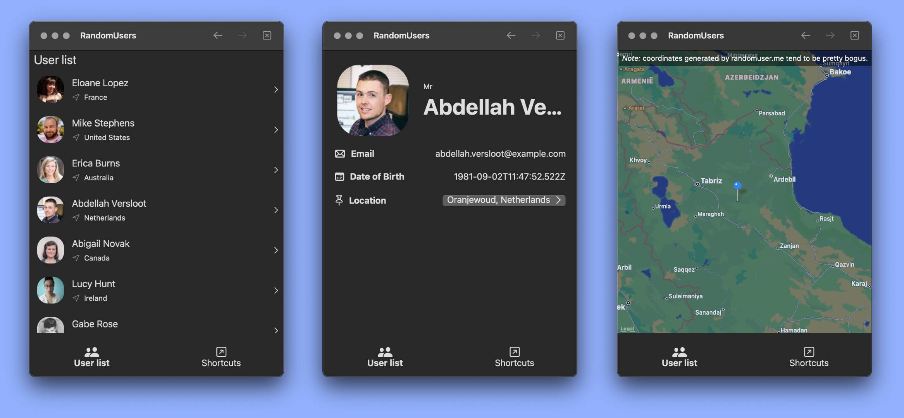

# RandomUsers App
> A contacts-like app with randomly generated users from [randomuser.me](https://randomuser.me).

## Documentation
All important aspects and implementions are documented in the source code. Starting from [RandomUsersApp.swift](Shared/RandomUsersApp.swift), you can follow the numbered documentation to get a tour of the app's routing logic.

If you are new to path-based routing and/or [SwiftUI Router](https://github.com/frzi/SwiftUIRouter) then this is a great example to discover and learn the basics.

This example demonstrates:
* A way to structure your routes
* Route parameters (aka placeholders)
* Route parameter validation and transforming
* Fallback routes
* Navigating with `NavLink`