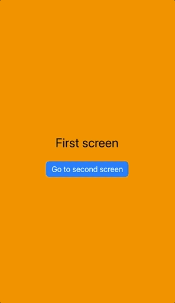

# Swiping example
> Creating a similar swipe-to-go-back effect on iOS.

Because [SwiftUI Router](https://github.com/frzi/SwiftUIRouter) doesn't work with SwiftUI's `NavigationView`, you do not get the swipe-from-the-side-to-go-back UX for free. This sample project showcases a possible way to create a similar experience, with two different visual effects.